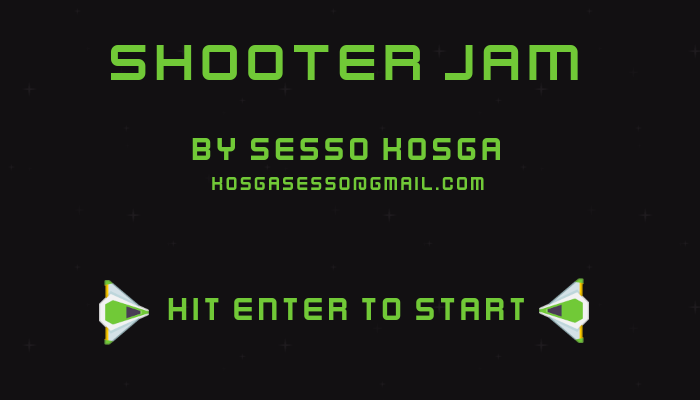
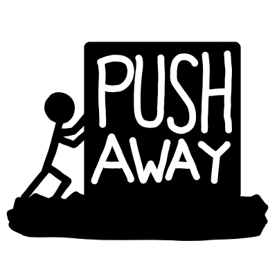
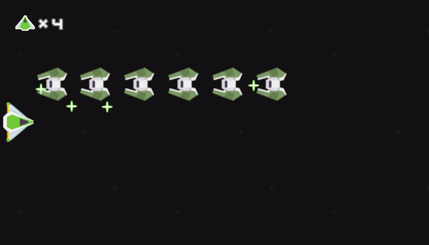
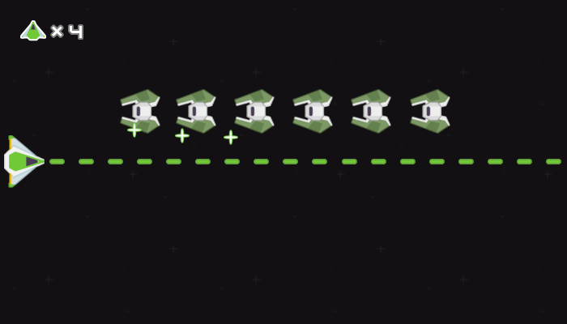
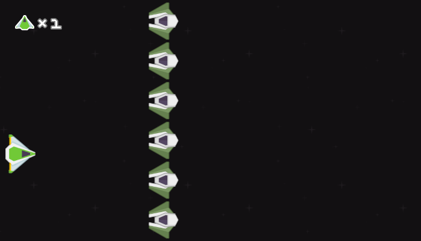
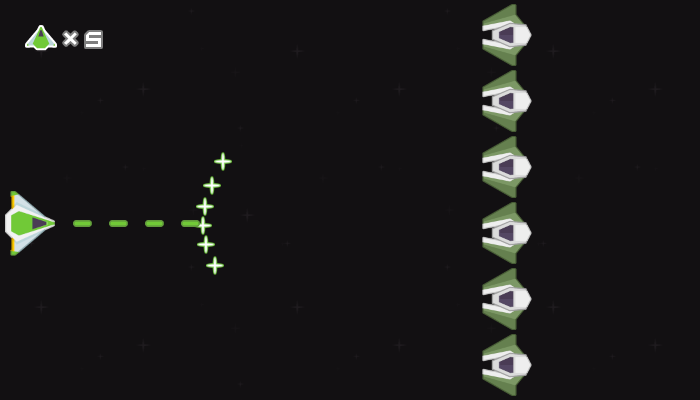
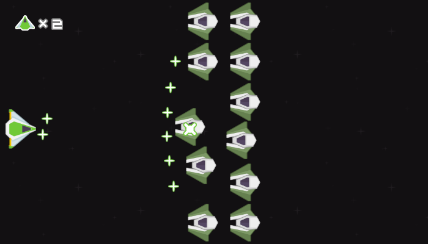
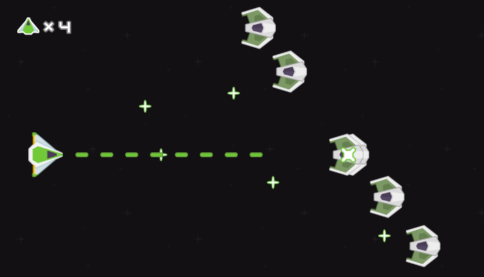
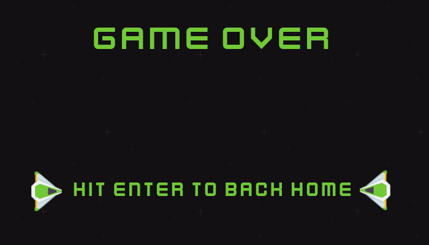

# Shooter Jam

An `HTML 5` Horizontal Shooter [Link to itch.io project](https://senor16.itch.io/shooter-jam)

### Description
You're in command of a spaceship. You in a foreign galaxy and should get home.

But enemies ship are on your way. 

Use arrow keys to move

Space bar to shoot

and X key to shoot a special weapon

You can pause the game by hitting Enter

## Made for the [StraightUp GameJam 2](https://itch.io/jam/straightupgamejam2) 
### Theme :  

### Flavor : 

### How does the game fit into the Theme?
You're in command of a spaceship. You in a foreign galaxy and want to get home. But numerous enemies ship are on your way. You'll use a special weapon to pull enemies spaceship together and destroy them.

### How does the game incorporate the Flavor?
When using the special weapon, if there is not enough spaceship in front, the weapon ill push those spaceships away

## Screenshots

By Senor16
